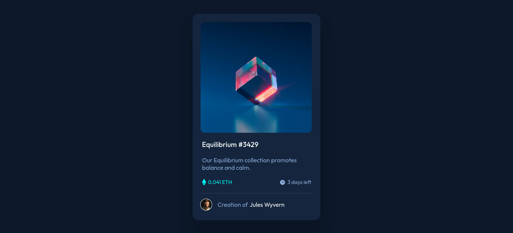

# Frontend Mentor - NFT preview card component solution

This is a solution to the [NFT preview card component challenge on Frontend Mentor](https://www.frontendmentor.io/challenges/nft-preview-card-component-SbdUL_w0U). Frontend Mentor challenges help you improve your coding skills by building realistic projects. 

## Table of contents

- [The challenge](#the-challenge)
- [Screenshot](#screenshot)
- [Links](#links)
- [My process](#my-process)
- [Built with](#built-with)
- [What I learned](#what-i-learned)
- [Author](#author)

### The challenge

Users should be able to:

- View the optimal layout depending on their device's screen size
- See hover states for interactive elements

### Screenshot



Add a screenshot of your solution. The easiest way to do this is to use Firefox to view your project, right-click the page and select "Take a Screenshot". You can choose either a full-height screenshot or a cropped one based on how long the page is. If it's very long, it might be best to crop it.

Alternatively, you can use a tool like [FireShot](https://getfireshot.com/) to take the screenshot. FireShot has a free option, so you don't need to purchase it. 

Then crop/optimize/edit your image however you like, add it to your project, and update the file path in the image above.

**Note: Delete this note and the paragraphs above when you add your screenshot. If you prefer not to add a screenshot, feel free to remove this entire section.**

### Links

- Solution URL: [https://github.com/navarcus/nft-card-challange](https://your-solution-url.com)
- Live Site URL: [https://navarcus.github.io/nft-card-challange/](https://your-live-site-url.com)


### Built with

- Semantic HTML5 markup
- CSS custom properties
- Flexbox

### What I learned

Use this section to recap over some of your major learnings while working through this project. Writing these out and providing code samples of areas you want to highlight is a great way to reinforce your own knowledge.


```css
.container {
	margin: auto;
	margin-top: 6vh;
	width: 340px;
	display: flex;
	text-align: start;
	align-items: center;
	align-content: center;
	flex-direction: column;
	background-color: hsl(216, 50%, 16%);
	border-radius: 15px;
	box-shadow: 0px 20px 25px 15px rgba(0, 0, 0, 0.05),
		0px 40px 30px 15px rgba(0, 0, 0, 0.1);
}
.main-img {
	position: relative;
	width: 100%;
	display: flex;
	max-width: 300px;
	border-radius: 4%;
	margin-top: 11px;
	margin-right: 4px;
}
.main-img::after {
	background: hsla(178, 100%, 50%, 0.5);
	content: url(images/icon-view.svg);
	position: absolute;
	inset: 0;
	display: flex;
	justify-content: center;
	align-items: center;
	opacity: 0;
	transition: all 0.3s ease;
	border-radius: 4%;
	margin-top: 11px;
	margin-left: 4px;
	margin-right: 3px;
}
.main-img:hover:after {
	opacity: 1;
	cursor: pointer;
}
```


## Author

- Frontend Mentor - [@yourusername](https://www.frontendmentor.io/profile/navarcus)
